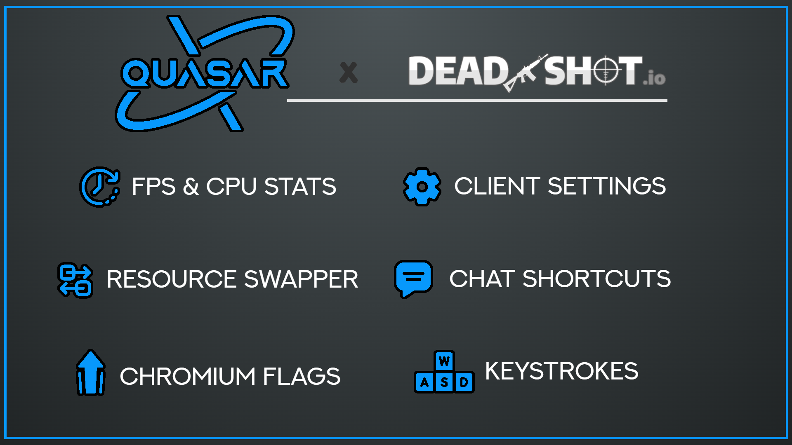

# Quasar Deadshot Client `PUBLIC 1.0`

Introducing the best client for [Deadshot.io](https://deadshot.io/) that exists and will ever exist!

#

Some of the CRAZY FEATURES in this client include:
 
- Runs on your computer when you open it
- Allows you to play Deadshot

#

#

### Credits

* **LordPhyre/skill:** Project Manager/Developer
* **jcjms:** Lead Developer
* **Classy08/Captain Cool:** Assistant Developer
* **Armaccord#9846:** Official Quasar skins

#

### Key Features:

Credits: Iniquity#2313 | Owner of [Arbiter Design](https://www.arbiterdesign.net/).

# Building Guide
Do you want to build Quasar from source to test out the latest changes or make your own? 
If so, you can follow the steps below.

- Extract the folder or use git clone then open command prompt inside the directory.
- Type `npm i --save-dev electron` to install required dependencies.
- To run the application, type `npm run start`
- If you have applied code changes, you will need to restart the application by closing it and running it again.
- If you have a feature request or bug fix, please test it out locally before starting a pull request.

Good luck!

#

### What we are currently working on:
- [x] Preparing everything for public v1

### Later.....
- [ ] Controller Support
- [ ] Custom Resource Marketplace

### Known 'bugs' 🚨🪲
- [ ] Typing Numbers activate Shortcuts

### Features that will only be possible with the help of our friend tree 🙂:
- [ ] Screenshake (need to know if damage)
- [ ] Custom Damage Vignette (need to know if damage)
- [ ] Reload Warning (need to know ammo amount)
- [ ] Auto Reload (need to know ammo amount)
#
### Detailed list of features:

- WASD Detector
- PC-Stats:
    - FPS-Counter
    - Ping
    - Platform
    - CPU Usage
    - Memory Usage
    - Total Memory
    - CPU Cores
    - Uptime
- Custom Chat Shortcuts [Keys 1-5]
- Resource Swapper / Loader
    - Gun Skin Menu
    - Skybox Menu
    - Texture Pack Support
        - Small Quasar Texture Pack
        - Custom Skins
- Chromium Flags Support
- Customizable UI
- Auto Fullscreen
- Discord RPC
    - Custom Text
- Dev Settings (3x click on version number)
    - Debug Mode
    - Splash Screen Switcher
