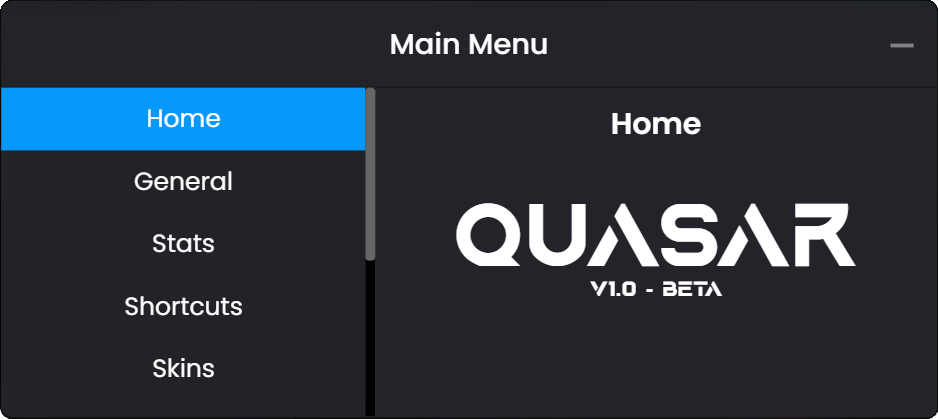

# Quasar Deadshot Client `PUBLIC 1.0`

Introducing the most advanced and simultaneously user-friendly client for [Deadshot.io](https://deadshot.io/) that exists and will ever exist.

This client contains many unique features found nowhere else, such as a fully customizable Graphical User Interface, with many performance and cosmetic options. It also includes a completely easy to use skin and resource swapper to completely change the look and feel of your game. 

Additionally, although there are many advanced features planned for the future, why wait? Download the latest version to try it out for yourself.

I highly encourage everyone to try it out. Truly a game-changing experience.
 
#

#

### Credits

* **LordPhyre/skill:** Project Manager/Developer
* **jcjms:** Lead Developer
* **Classy08/Captain Cool:** Resource Swapper
* **Alez:** Original Deadshot Client
* **Gato:** (we stole his ideas. teehee)
* **And of course, all the members of Cosmic [csm] who contributed with great ideas.**

#

### What we are currently working on:
- [x] Preparing everything for official v1

### Features / To-Do List:
- [x] Persistent Color Settings
- [x] GG Shortcut
- [x] Customizable UI
- [x] Custom Chat Shortcuts
- [x] Fully functioning JSON-Based Settings Saver
- [x] Offline Screen
- [x] PC Stats
- [x] Resource Swapper [Weapons, Sky, Map Textures, Scripts]
- [x] Texture-Pack loading
- [x] Chromium Flags
- [x] WASD Detector
- [x] Aimbot 😱

### Later.....
- [ ] Auto Updates
- [ ] Controller Support
- [ ] Automatic Debug Disable
- [ ] Local Player Wireframe
- [ ] FOV Slider 🤔
- [ ] Sound Swapper
- [ ] Gamma Editor
- [ ] Instant-180
- [ ] Leaderboard rewards 👀
- [ ] Custom Client Keybinds
- [ ] Custom Resource Marketplace
- [ ] Discord RPC
- [ ] Custom Background/Wallpaper

### Known bugs 🚨🪲
- [ ] Scrolling Issues
- [ ] Typing Numbers activate Shortcuts

### Featues that will only be possible with the help of our friend tree 🙂:
- [ ] Screenshake (need to know if damage)
- [ ] Custom Damage Vignette (need to know if damage)
- [ ] Reload Warning (need to know ammo amount)
- [ ] Auto Reload (need to know ammo amount)

# Building Guide
Do you want to build Quasar from source to test out the latest changes or make your own? 
If so, you can follow the steps below.

- Extract the folder or use git clone then open command prompt inside the directory.
- Type `npm i --save-dev electron` to install required dependencies.
- To run the application, type `npm run start`
- If you have applied code changes, you will need to restart the application by closing it and running it again.
- If you have a feature request or bug fix, please test it out locally before starting a pull request.

Good luck!

#
### Detailed list of features:

- WASD Detector
- PC-Stats:
    - FPS-Counter
    - Ping
    - Platform
    - CPU Usage
    - Memory Usage
    - Total Memory
    - CPU Cores
    - Uptime
- Custom Chat Shortcuts [Keys 2-5]
    - Shortcut Display
- Resource Swapper / Loader
    - Gun Skin Menu
    - Skybox Menu
    - General Swapper Folder
    - Texture Pack Support
        - Small Quasar Texture Pack
- Chromium Flags Support
    - disable-print-preview
    - javascript-harmony
    - renderer-process-limit
    - max-active-webgl-contexts
    - ignore-gpu-blocklist
    - disable-2d-canvas-clip-aa
    - disable-logging
    - in-process-gpu
    - disable-accelerated-2d-canvas
- Customizable UI
- Auto Fullscreen
- Fully functioning JSON-Based Settings Saver (secure your settings)
- Offline Screen
- Dev Settings
    - Debug Mode

#