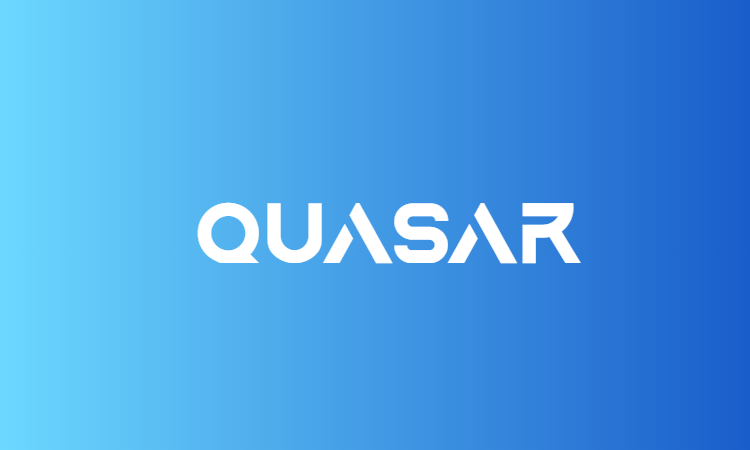

# Quasar Deadshot Client `BETA 1.0`

Introducing the most advanced and simultaneously user-friendly client for [Deadshot.io](https://deadshot.io/) that exists and will ever exist. Hopefully.

This client contains many unique features found nowhere else, such as a fully customizable Graphical User Interface, with many performance and cosmetic options. It also includes a completely easy to use skin and resource swapper to completely change the look and feel of your game. 

Never before such power has been instilled into a downloadable software client for a webgame. NEVER. Its just so goddamn awesome.

I highly encourage everyone to try it out. Truly a game-changing experience.
 
# 

#

### Credits

* **LordPhyre/skill:** Project Manager/Developer
* **jcjms:** Lead Developer
* **Classy08/Captain Cool:** Resource Swapper
* **Alez:** Original Deadshot Client
* **Gato:** (we stole his ideas. teehee)
* **And of course, all the members of Cosmic [csm] who contributed with great ideas.**

#

### To-Do List:
- [ ] Fix JSON Loading Glitches and Elements not Functioning
- [x] GG Button
- [x] Random Cool Looking GUI Elements 😎
- [ ] Gamma Editor
- [x] Resource Swapper [Weapons, Sky, Map-Textures, Scripts]
- [ ] Texture-Pack loading
- [ ] FPS-Boost Texture-Pack
- [x] Chromium Flags
- [ ] Custom Resource Marketplace
- [ ] FOV Slider
- [x] PC Stats
- [x] WASD Detector
- [ ] Local Player Wireframe
- [x] Custom Chat Shortcuts
- [ ] Custom Client Keybinds
- [x] Customizable UI
- [x] Aimbot
- [ ] Sound Swapper
- [ ] Controller Support

### Featues that will only be possible with the help of our friend tree : ):
- [ ] Auto-GG (need to know round status + name of killer)
- [ ] Auto Re-Join Button (need to know round status)
- [ ] Screenshake (need to know if damage)
- [ ] Custom Damage Vignette (need to know if damage)
- [ ] Reload Warning (need to know ammo amount)
- [ ] Auto Reload (need to know ammo amount)
- [ ] Custom Background/Wallpaper (need to know if round started to remove img)
